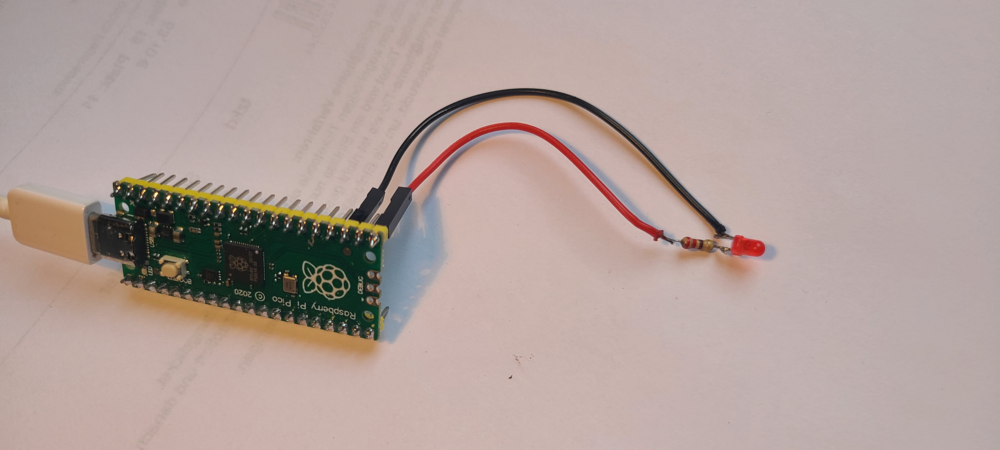

# 💡 Einzel-LED Grundlagen

*Für Kursleiter\*innen: Essentielles Wissen zur einzelnen LED. Praktische Details werden im Kurs live erklärt.*

## Was ist eine LED?
Eine **LED** (Licht-Emittierende Diode) ist ein elektronisches Bauteil, das Licht abgibt, wenn Strom hindurchfließt. Sie ist sehr effizient und in vielen Farben erhältlich.

### Vorteile für den Kurs:
- **Sehr einfach**: Nur 2 Anschlüsse (Plus/Minus)
- **Sicher**: Geringe Spannung, keine Verletzungsgefahr
- **Sofort sichtbarer Effekt**: Erfolgserlebnis garantiert

## 🔌 Anschluss einer LED am Raspberry Pi Pico

### Benötigte Bauteile:
- 1x LED (z.B. rot)
- 1x 220 Ohm Widerstand (Schutz für die LED)
- 2x Jumper-Kabel

### Schaltskizze:
```
LED (+) Anode  → Widerstand → GP15 (Pico)
LED (-) Kathode → GND (Pico)
```

### Merksatz für LED: Kurz, Kathode, Kante

- **Kurz**: Das kürzere Bein der LED ist die **Kathode** (Minuspol).
- **Kante**: Manche LEDs haben eine kleine **Kante** oder Abflachung am Gehäuse – diese zeigt zur Kathode.
### Beispiel-Foto: Einzelne LED am Raspberry Pi Pico


*Das Foto zeigt eine einzelne LED mit Widerstand, verbunden mit dem Raspberry Pi Pico. Die Anode ist über den Widerstand an GP15 angeschlossen, die Kathode an GND.*

## 📝 Beispiel-Code
```python
import machine
import time

led = machine.Pin(15, machine.Pin.OUT)

# LED blinken lassen
for i in range(10):
    led.value(1)  # AN
    time.sleep(0.5)
    led.value(0)  # AUS
    time.sleep(0.5)
```

## ⚠️ Häufige Fehler
- LED falsch herum eingesteckt (Anode/Kathode vertauscht)
- Widerstand vergessen (LED wird zu heiß)
- Falscher Pin im Code

## 🎯 Lernziele
- Schaltplan lesen und umsetzen
- GPIO Pin ansteuern
- Zeitsteuerung mit `time.sleep()`

---

**Nächster Schritt:** LED-Streifen mit mehreren LEDs steuern!
