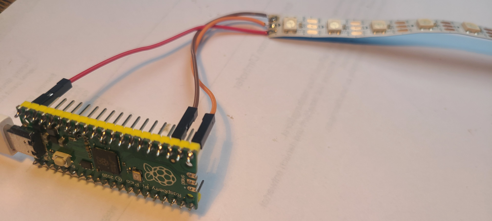

# 🌈 LED-Streifen Grundlagen

## Was sind LED-Streifen?
**WS2812B LED-Streifen** sind intelligente LEDs, die einzeln steuerbar sind. Jede LED kann 16,7 Millionen verschiedene Farben darstellen.

## 🎨 RGB-Farbsystem

### Grundprinzip
Jede Farbe entsteht durch Mischen von **R**ot, **G**rün und **B**lau (Werte 0-255):

```python
# Grundfarben
ROT = (255, 0, 0)
GRUEN = (0, 255, 0)  
BLAU = (0, 0, 255)
WEISS = (255, 255, 255)
SCHWARZ = (0, 0, 0)  # = AUS

# Mischfarben
GELB = (255, 255, 0)     # Rot + Grün
LILA = (255, 0, 255)     # Rot + Blau
ORANGE = (255, 128, 0)   # Rot + wenig Grün
```

## 🔌 Hardware-Anschluss

### Die 3 wichtigen Kabel (Raspberry Pi Pico):
```
LED-Streifen    →    Raspberry Pi Pico
────────────         ────────────────
🔴 5V (Strom)   →    VSYS (5V) Pin 39
⚫ GND (Minus)   →    GND
🟢 DIN (Daten)  →    GP16
```

### Beispielbild: LED-Streifen



*Das Bild zeigt einen typischen WS2812B LED-Streifen, wie er im Kurs verwendet wird.*
> 💡 **Hinweis:** Falls Jumperkabel verlötet werden sollen, achtet darauf, dass sie Kupfer-Litzen besitzen. Günstige Jumperkabel bestehen oft aus CCA (Copper Clad Aluminum) und lassen sich schlecht löten.


### Einfaches Setup-Schema:
```python
# Standard-Konfiguration für den Kurs
import machine
from neopixel import NeoPixel

LED_GP = 16                                 # GPIO16 für Datenleitung
ANZAHL_LEDS = 10                            # Standard-Streifenlänge
pin = machine.Pin(LED_GP, machine.Pin.OUT)  # Pin als Ausgang setzen
leds = NeoPixel(pin, ANZAHL_LEDS)           # leds initialisieren
```


## � Grundlegende LED-Steuerung

### Das wichtigste Code-Pattern:
```python
# LEDs einstellen
leds[0] = (255, 0, 0)  # LED 0 → rot
leds[1] = (0, 255, 0)  # LED 1 → grün

# KRITISCH: Änderungen anzeigen!
leds.write()  # Ohne das passiert nichts!
```

### Alle LEDs auf einmal:
```python
# Alle LEDs rot
for i in range(10):
    leds[i] = (255, 0, 0)
leds.write()
```

## � Häufige Anfängerfehler

### 1. `write()` vergessen
```python
# ❌ Falsch - nichts passiert
leds[0] = (255, 0, 0)

# ✅ Richtig
leds[0] = (255, 0, 0)
leds.write()  # Immer nötig!
```

### 2. Falsche LED-Indizes
```python
# Bei 10 LEDs: 0, 1, 2, 3, 4, 5, 6, 7, 8, 9
leds[10] = (255, 0, 0)  # ❌ FEHLER! LED 10 existiert nicht
leds[9] = (255, 0, 0)   # ✅ Richtig - letzte LED
```

### 3. RGB-Reihenfolge verwechseln
```python
# RGB = (Rot, Grün, Blau)
leds[0] = (255, 0, 0)   # ✅ Rot
leds[0] = (0, 255, 0)   # ✅ Grün  
leds[0] = (0, 0, 255)   # ✅ Blau
```

## 🎯 Effekte im Kurs

- **Level 1**: Einzelne LEDs, Farben ändern
- **Level 2**: Lauflicht, Blinken
- **Level 3**: Regenbogen, kreative Animationen


## ⚡ Stromverbrauch

### Wichtige Regel für Schüler\*innen:
```
1 LED   = ~60mA
10 LEDs = ~600mA  ✅ Raspberry Pi Pico schafft das
20 LEDs = ~1200mA ⚠️  Grenzbereich
30+ LEDs = ❌ Externes Netzteil nötig
```

**Für den Kurs: Max. 20 LEDs über USB-Stromversorgung**